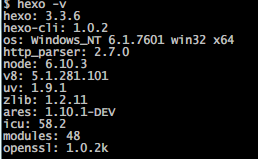
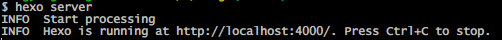

---
title: Hexo教程

date: 2017-05-23 11:58:10

categories: "Hexo教程"
tags:

       - Hexo
description: 部署Hexo博客
---

## 配置环境

1.安装Node.js

2.安装Git

3. 申请GitHub


## 安装Hexo
1.打开Git Bash, 输入

```bash
$npm install hexo-cli -g
$npm install hexo --save
```

然后输入以下命令查看Hexo的版本信息：

```bash
$hexo -v
```

如果出现类似内容说明安装成功。



## Hexo的初始设置

1.新建Blog文件夹。如在E盘中新建Blog文件夹

2.使用GitBush进入文件夹中，并初始化博客目录

```bash
$cd e:Blog
$hexo init
```

然后输入
```bash
$npm install
```

之后npm将会自动安装需要的组件，只需等待npm操作即可。

3.与GitHub连接
   在GitHub中建立与用户名对应的Repository，名称必须为【your_user_name.github.io】,如jpsxno1.github.io
,此为固定写法。
   在站点配置文件（即Blog文件夹下的_config.yml）中找到deploy，并添加对应配置：

	# Deployment
	## Docs: http://hexo.io/docs/deployment.html
	deploy:
	type: git
	repo: https://github.com/jpsxno1/jpsxno1.github.io.git
	branch: master

然后安装插件

```bash
$npm install hexo-deployer-git --save
```

## Hexo的简单使用

1.新建文章

```bash
$hexo new "文章名"
```

然后就可以在Blog/source/_posts文件夹下找到对应的.md文件。使用编辑器打开：

---
title: FirstUse

date: 2017-05-23 10:20:02

tags:

---


在下面就可以接着写文章的内容，如：

---
title: FirstUse

date: 2017-05-23 10:20:02

tags:

---

这是我第一次使用Hexo，参考了网上的一些教程自己弄了个个人博客。以后我会在这个博客中记录学习、生活中的一些事。

2.生成页面

```bash
$hexo generate
```

3.页面预览

```bash
$hexo server
```

然后会看到这样一条提示：



现在打开浏览器就可以访问 http://localhost:4000/。

4.发布到GitHub

```bash
$hexo deploy
```

然后再GitHub上便能看到刚刚部署的Web网站：https://jpsxno1.github.io/
每次部署的步骤，可分为三步：

hexo clean

hexo generate

hexo deploy


